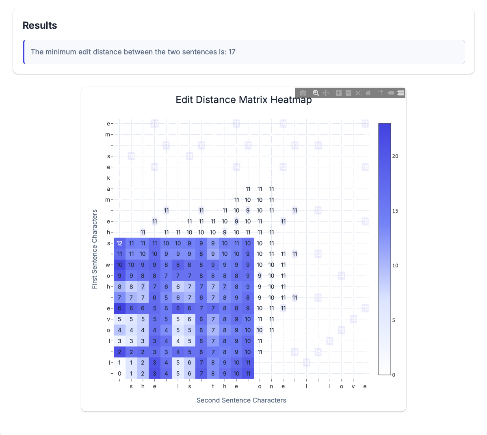

# Minimum Edit Distance Visualizer

An interactive web application that visualizes the minimum edit distance (Levenshtein distance) between two sentences using a dynamic heatmap. The application provides an intuitive way to understand how the edit distance algorithm works by showing the dynamic programming matrix.



## Features

- Input two sentences for comparison
- Interactive heatmap visualization of the edit distance matrix
- Color-coded cells showing the progression of the algorithm
- Hover information displaying cell values and character matches
- Responsive design that works on all devices
- Clean and modern user interface with smooth animations

## Demo

The heatmap above shows the edit distance calculation between two example sentences. The colors represent:
- Lighter shades: Lower edit distance values
- Darker shades: Higher edit distance values
- Highlighted cells: Character matches between the two sentences

## Installation

1. Clone the repository:
```bash
git clone https://github.com/yourusername/minimum-edit-distance-visualizer.git
cd minimum-edit-distance-visualizer
```

2. Create a virtual environment (optional but recommended):
```bash
python -m venv venv
source venv/bin/activate  # On Windows: venv\Scripts\activate
```

3. Install the required dependencies:
```bash
pip install -r requirements.txt
```

## Usage

1. Start the Flask application:
```bash
python app.py
```

2. Open your web browser and navigate to `http://localhost:5000`

3. Enter two sentences in the input boxes and click "Calculate Distance"

4. The visualization will show:
   - The minimum edit distance between the sentences
   - A heatmap of the dynamic programming matrix
   - Character matches highlighted in the matrix

## Technical Details

The application uses:
- **Backend**: Flask and NumPy for calculations
- **Frontend**: 
  - Plotly.js for the interactive heatmap
  - Modern CSS with animations and transitions
  - Responsive design principles

## Project Structure

```
minimum-edit-distance-visualizer/
├── app.py                 # Flask application and edit distance logic
├── requirements.txt       # Python dependencies
├── static/
│   ├── css/
│   │   └── styles.css    # Separated CSS styles
│   └── js/
│       └── script.js     # Separated JavaScript code
├── templates/
│   └── index.html        # Main HTML template
└── docs/
    └── heatmap_example.png  # Example visualization
```

## Contributing

Feel free to open issues or submit pull requests if you have suggestions for improvements or find any bugs.

## License

This project is licensed under the MIT License - see the LICENSE file for details.
